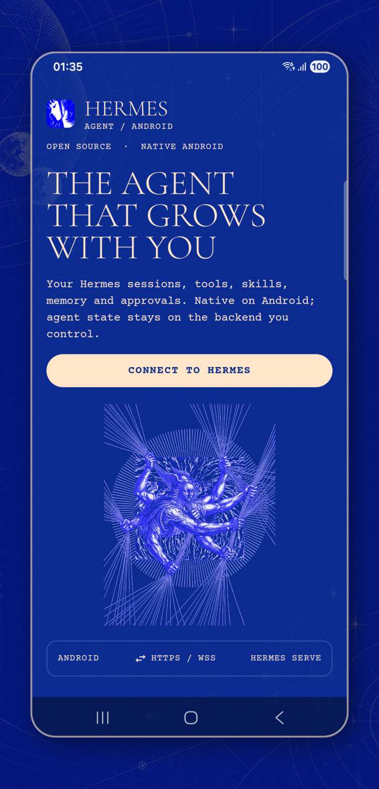
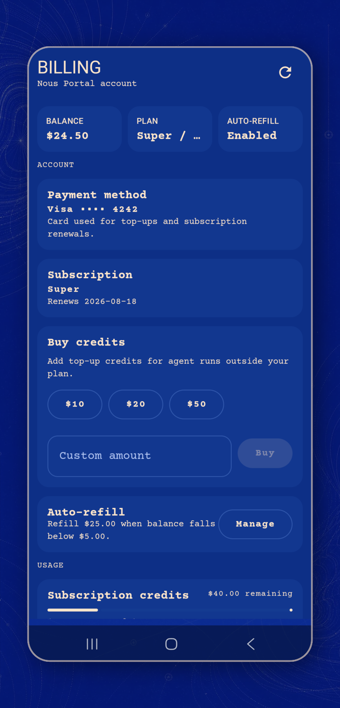
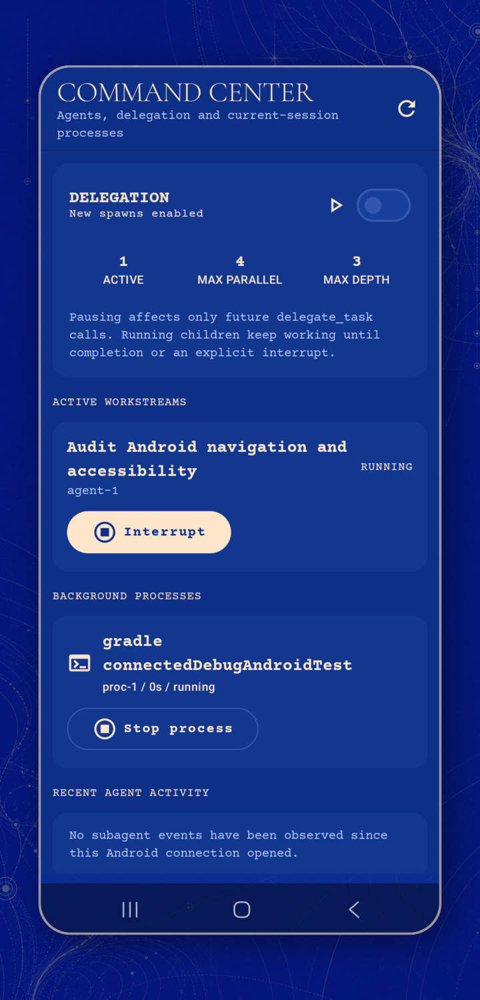

# Hermes for Android

<p align="center">
  
</p>

[](https://github.com/luinbytes/hermes-android/releases/latest/download/hermes-android-release.apk)
[](https://github.com/luinbytes/hermes-android/releases/latest/download/hermes-android-release.aab)
[](https://github.com/luinbytes/hermes-android/actions/workflows/ci.yml?query=branch%3Adev+status%3Asuccess)

Native Android client for [Nous Research Hermes Agent](https://github.com/NousResearch/hermes-agent). The project targets first-party-quality integration with the same Dashboard backend, sessions, profiles, skills, tools, models, providers, and automations used by Hermes Desktop, CLI, and TUI.

This repository is an independent work in progress. It is not currently an official Nous Research release. Visible controls are backed by real Hermes REST or JSON-RPC/WebSocket operations; unavailable features are omitted rather than simulated.

<table>
  <tr>
    <td width="33%"></td>
    <td width="33%"></td>
    <td width="33%"></td>
  </tr>
  <tr>
    <td align="center"><sub>Nous onboarding</sub></td>
    <td align="center"><sub>Nous Portal billing</sub></td>
    <td align="center"><sub>Command Center</sub></td>
  </tr>
</table>

The screenshots were captured on a Samsung SM-S906E running Android 16 in dark mode. Billing and Command Center use deterministic, non-secret showcase state.

## Project status

Last full QA and device verification: 7 August 2026. Version 1.0.0 was released from `main` on 9 August 2026 after its tests, lint, signed release build, signature checks, checksums, and provenance attestation passed.

The current `dev` checkout passes all unit tests, Android lint, debug APK assembly, and debug app-bundle assembly. Pushes to `dev` publish artifacts under one stable debug certificate. Successful pushes to `main` publish minified APK and AAB artifacts under a separate stable release certificate, then update the fixed download links above. The 7 August CI artifact completed provider discovery, password login, access/refresh/provider cookie rotation, ticket-only WebSocket validation, encrypted session restoration after process death, and expired-session recovery on a headless Android 16 Google Play emulator. The debug APK has also been installed and exercised on a Samsung SM-S906E running Android 16 for onboarding, light/dark theme, large-text, IME, reduced-motion, saved-session reconnect, process-restarted draft restoration, full-text session search, confirmed session deletion, confirmed live-session reset, managed workspace browsing, text and sandboxed HTML previews, and real secured upstream integration QA. The upstream smoke used an isolated Hermes home at the audited commit, temporary basic-auth credentials, and no paid provider key.

See [Android signing and branch flow](docs/release-signing.md) for the public certificate fingerprints, artifact names, and promotion contract.

### Implemented

- [x] Dashboard username/password onboarding through `POST /auth/password-login`
- [x] Advertised password-provider discovery plus bounded access, rotating-refresh, and provider-routing session-cookie validation
- [x] Authenticated `/api/status` REST validation using the Dashboard cookie
- [x] Cookie-authenticated `POST /api/auth/ws-ticket` followed by authenticated `/api/ws?ticket=` JSON-RPC WebSocket handshake
- [x] Save only after login, REST, ticket minting, and WebSocket validation all succeed
- [x] Android Keystore-backed AES-GCM session-cookie storage; passwords are never persisted
- [x] Explicit reconnect state for missing, expired, rejected, or legacy token-only credentials
- [x] Multiple saved backends with add, reconnect, select, and forget flows
- [x] HTTPS plus explicitly approved cleartext private-IP transport policy
- [x] Unified cross-profile session list, profile-scoped full-text search, resume, confirmed reset, retry, rename, archive, delete, branch, undo, compression, and steering
- [x] Backend/profile/session-scoped draft persistence across Android process restart, with debounced writes and cleanup when a backend is forgotten
- [x] Session-scoped composer history derived from authoritative user messages, with a mobile picker and Ctrl+Up/Ctrl+Down navigation
- [x] Durable active-session pending-message queue with FIFO drain, edit/remove/retry controls, and bounded failure handling through Hermes `prompt.submit`
- [x] Gateway-backed slash command catalogue, live completions, argument replacement, curated mobile execution, skill and quick-command dispatch, inline output, and composer prefill
- [x] Streamed assistant text, reasoning, status, and structured tool activity
- [x] Completed assistant GFM Markdown with headings, lists, quotes, tables, inline code, rounded syntax-highlighted code blocks, and constrained external web links
- [x] Dangerous-command approval, denial, clarification, interruption, session-only YOLO, and non-persistent masked sudo/secret prompts with expiry handling
- [x] Dynamic Hermes model/provider catalogue, model selection, reasoning effort, and fast mode
- [x] Provider API-key and custom-endpoint management through Hermes-owned APIs
- [x] Profile-scoped provider account sign-in matching Desktop Accounts and API Keys, including server-advertised PKCE, device-code polling, external CLI handoff, and confirmed disconnect
- [x] SAF file, image, and PDF attachments with bounded reads and server-queue cleanup
- [x] Android share-target ingestion for bounded text and `content://` attachments into a draft session without automatic sending
- [x] Managed workspace browsing with directory navigation, bounded text/source/image/PDF previews, network-isolated HTML rendering, streamed SAF downloads, cancellation, and MIME/path validation
- [x] Press-to-talk and lockable voice capture through Hermes `/api/audio/transcribe`, with slide-to-lock/cancel, live level feedback, bounded temporary audio, permission recovery, and audio-focus interruption handling
- [x] Per-reply spoken playback through Hermes' own `/api/audio/speak` provider chain, with pause, resume, stop, system output routing, Bluetooth support, and temporary-audio cleanup
- [x] Completed-message text selection, whole-message copy/share, and previewed workspace-file save/share/open-with actions
- [x] Profile-scoped messaging-gateway catalogue, platform status, Hermes-owned credential setup/removal, enable/disable, connection tests, and explicitly confirmed gateway restart
- [x] Profile-scoped MCP configured-server and Nous catalogue views, backend probes, reviewed catalog installation, confirmed removal, enable/disable, background-install polling, and live `reload.mcp`
- [x] Profile-scoped 7/30/90-day token, API-call, model, tool, skill, cost, and live-session context breakdowns
- [x] Nous billing account, plan, balance, payment method, credit usage, confirmed top-ups, auto-refill, portal management, and billing-scope device verification through Desktop's gateway RPCs
- [x] Session-scoped checkpoint listing, bounded diff preview, and explicitly confirmed full workspace rollback with authoritative history reload
- [x] Command Center with live Hermes subagent trees, TUI-persisted cross-session spawn-tree replay, delegation pause/resume, confirmed subagent interruption, current-session background-process output, and confirmed process stop
- [x] Profile list, create, rename, delete, selection, and profile-scoped sessions
- [x] Installed skills plus Skill Hub search, review, scan, install, update, enable/disable, and removal
- [x] Profile-scoped Hermes toolset catalogue with server-advertised platform, setup state, tools, and enable/disable controls for future sessions
- [x] Schema-driven profile configuration for an audited safe set of server-advertised boolean, number, select, and text fields using one-field deep-merge writes
- [x] Cron list, create, edit, delete, enable/disable, run-now, and recent server-side runs
- [x] Doctor and security-audit actions with bounded status polling and output redaction
- [x] Optional durable secure-screen mode that blocks screenshots, screen recording, and recent-app thumbnails
- [x] Phone master/detail and expanded tablet two-pane layouts
- [x] Official Hermes site palette and artwork, Courier Prime utility typography, licensed serif fallback, rounded component geometry, and official Desktop launcher icon
- [x] Nous-only ambient field backdrop with three main plates, three dedicated transition plates, 8-second crossfades, lifecycle pause, reduced-motion handling, and battery-saver freeze
- [x] Stable branch-specific signing: update-compatible debug APK/AAB artifacts from `dev` and dedicated release APK/AAB artifacts plus R8 mapping from `main`
- [x] Unknown protocol fields and event types fail safely instead of crashing the client

### Partial foundations

- [ ] **Partial:** reconnect uses bounded backoff and authoritative session rehydration, but exact in-flight delta replay needs a server event cursor.
- [ ] **Partial:** typed tool, media, file, diff, terminal, delegation, clarification, reference, and bounded unknown renderers are native; canonical server provenance is still capability-gated where Hermes does not send it.
- [ ] **Partial:** attachment sending, native camera capture, per-item lifecycle/progress, and managed downloads/previews/actions work; resumable background upload waits for a server-owned descriptor and receipt contract.
- [ ] **Partial:** semantics, keyboard Escape/back, 200% text, adaptive layouts, reduced motion, RTL, and streaming-focus checks exist; the physical TalkBack, Switch Access, foldable, and multi-window matrix remains owner validation.
- [x] Diagnostics expose versions, connection state, doctor, security-audit results, and an allowlisted redacted SAF report. Candidate CI retains reproducibility, SBOM, and checksum evidence. Main release CI publishes signed artifacts, mapping, checksums, and provenance attestations.

### Correctness fixes

- [x] Large checkpoint previews retain a full-response fingerprint for pre-restore validation, so bounded display does not reject unchanged large diffs or miss changes beyond the display limit.
- [x] Android share payloads remain pending when session creation or attachment ingestion fails, and successful partial attachments are identified for a safe retry.
- [x] MCP catalogue diagnostics, probe failures, and reload errors are redacted before entering Android UI state.
- [x] Unreadable pending-message queue data remains stored and blocks queue mutation with an explicit recovery message instead of being silently replaced.
- [x] A successful bounded reconnect clears its previous retry notice instead of showing a stale failure beside `LIVE / JSON-RPC`.
- [x] Production onboarding labels the required backend URL without embedding an example endpoint.

### Not yet implemented

- [ ] Native OAuth/OIDC sign-in for connecting the Android app itself to a Dashboard without username/password
- [ ] Background push delivery and notification actions; private local notification channels and validated destination routing are implemented, but Hermes advertises no device registration/action-token contract
- [x] Persisted appearance picker matching Hermes Desktop's built-in `nous`, `midnight`, `ember`, `mono`, `cyberpunk`, and `slate` palettes; Nous remains the default and Android follows the system light or dark setting
- [ ] MCP custom-server add/edit, remote-client OAuth setup, and per-tool filters
- [ ] Mobile background delivery for Agents when Android is suspended
- [ ] Local Termux runtime discovery or companion integration
- [x] Opt-in biometric re-entry, deep links, shortcuts, MediaSession controls, and purposeful voice haptics
- [x] Android home-screen widget provider with a privacy-safe New chat launch through the validated entry pipeline
- [ ] Play App Signing handoff and owner physical-device evidence. CI implements reproducibility, SBOM/provenance, API 36 macrobenchmarks, deterministic stress fixtures, Baseline Profile automation, and accepted-baseline comparison; the latest API 36 benchmark comparison still needs a green run.

The detailed, current source audit remains in [`docs/research/desktop-parity-matrix.md`](docs/research/desktop-parity-matrix.md).

## Connect to an existing Hermes install

Hermes Android connects to the existing secured Hermes Dashboard. It does not require weakened Dashboard authentication, a proxy credential bridge, a static bearer token, or changes to Caddy, host binding, or Hermes configuration.

The supplied URL must expose these standard Dashboard paths:

- `POST /auth/password-login`
- `GET /api/status`
- `POST /api/auth/ws-ticket`
- WebSocket `/api/ws`

In **Backend Link**, enter:

1. A local label for the connection.
2. The base Dashboard URL.
3. The existing Dashboard username.
4. The existing Dashboard password.

The app first reads the Dashboard's public authentication-provider catalogue and uses its sole advertised password provider; it never assumes the provider is named `basic`. It submits the credentials to the Dashboard login endpoint, requires a bounded access-cookie bundle, retains rotating refresh and provider-routing cookies when returned, validates authenticated REST, mints a fresh single-use WebSocket ticket, then validates `/api/ws?ticket=`. It saves the backend and encrypted session only after every step succeeds. Successful authenticated responses merge rotated cookies back into encrypted storage so an expired access token can renew without restoring the password. The password exists only long enough to submit the login request and is cleared from the transient input state; it is not written to DataStore, preferences, backups, diagnostics, or logs.

### Normal HTTPS

Use the public or private HTTPS URL that already serves the Dashboard, including its port when required:

```text
https://<dashboard-host>[:port]
```

HTTPS uses the Android system trust store. The app does not bypass certificate or hostname validation.

### Tailscale

Tailscale Serve or another trusted HTTPS route works with its normal MagicDNS URL:

```text
https://your-device.your-tailnet.ts.net
```

Direct cleartext access to a Tailscale IPv4 address is supported only when **Allow private-network HTTP** is explicitly enabled:

```text
http://100.79.4.2:PORT
```

### Private LAN or local development

Cleartext HTTP is disabled by default. With the private-network option enabled, it remains restricted to literal loopback, RFC1918, IPv6 ULA, or Tailscale CGNAT addresses, for example:

```text
http://192.168.1.20:PORT
http://127.0.0.1:PORT
```

Public hostnames over cleartext HTTP remain rejected. Private DNS names should use HTTPS; this prevents a DNS response from silently moving an approved connection onto a public address.

### Existing token-only records

Legacy token records are not migrated or reinterpreted. They display **Reconnect** and require the Dashboard username and password. Existing encrypted access-cookie records remain readable, while a successful reconnect replaces a legacy token with the complete renewable Dashboard session bundle.

If the Dashboard expires or rejects a saved cookie, the app removes it, disconnects the socket, and presents a reconnect-required state for that backend.

## Security model

- Dashboard access, refresh, and provider-routing session cookies are bounded and encrypted together with AES-GCM using a non-exportable Android Keystore key.
- `android:allowBackup` is disabled and the secret preferences file is excluded from device transfer.
- Session-cookie string representations are redacted.
- REST authentication uses the `Cookie` header; Dashboard sessions are not converted into bearer tokens.
- WebSocket authentication mints a fresh cookie-authenticated single-use ticket and places only that short-lived ticket in the upgrade query. The session cookie is not sent on the WebSocket upgrade.
- Passwords and session cookies are not included in backend metadata, UI diagnostics, or application logs.
- Failed login, missing/malformed cookies, REST failure, or WebSocket failure leaves no newly saved backend or credential.
- Cleartext transport has no silent fallback and requires both explicit consent and a private literal address.
- Unknown server messages are tolerated without treating them as trusted commands.

See [`docs/security/threat-model.md`](docs/security/threat-model.md) for the broader pre-release threat model. Do not expose a Hermes Dashboard directly to an untrusted network over cleartext HTTP.

## Build and test

Requirements:

- JDK 17
- Android SDK Platform 36
- Android SDK Build Tools 36.0.0

JDK 26 is not supported by the current Gradle/Android Gradle Plugin toolchain and can fail before project configuration. Point `JAVA_HOME` at JDK 17 when necessary.

Run the same project gate used by CI:

```bash
./gradlew --no-daemon -Phermes.provenance.channel=debug :app:testDebugUnitTest :app:lintDebug :app:writeBuildProvenance :app:assembleDebug :app:bundleDebug
```

Run only the Dashboard-authentication contract tests:

```bash
./gradlew --no-daemon :app:testDebugUnitTest \
  --tests com.nousresearch.hermes.network.DashboardAuthClientTest \
  --tests com.nousresearch.hermes.network.HermesRestClientSessionCookieTest \
  --tests com.nousresearch.hermes.protocol.OkHttpHermesGatewaySessionCookieTest \
  --tests com.nousresearch.hermes.data.DashboardBackendConnectorTest
```

Install the debug build:

```bash
adb install -r app/build/outputs/apk/debug/app-debug.apk
```

Successful `dev` pushes publish update-compatible debug APK and AAB files in the `hermes-android-dev-debug` workflow artifact. Successful `main` pushes publish signed, minified APK and AAB files to the latest GitHub release. The release badges at the top of this README point directly to those stable latest-release assets.

## Test coverage

The deterministic fake Dashboard exists only under `app/src/test`; production code always uses the configured Hermes Dashboard URL and real endpoints.

Current automated coverage includes:

- Login request payload and accepted Hermes session-cookie variants
- Successful cookie extraction plus missing and malformed cookie rejection
- Cookie reuse for authenticated REST without bearer authorization
- Cookie-authenticated single-use WebSocket ticket minting without a legacy token query or WebSocket cookie
- Login → REST → ticket → WebSocket → save ordering
- REST and WebSocket validation failures without persistence
- Expired saved-session reconnect behavior
- Legacy token-only record rejection without network reinterpretation
- Password non-persistence at the connect-and-save boundary
- Transport policy, protocol fixtures, reducers, session lifecycle, management routes, provider routes, Skill Hub routes, diagnostic redaction, and bounded diagnostic-report generation
- Profile-scoped MCP list/catalog/test/toggle/install/delete/action-status routes, session-cookie reuse, reviewed env-name filtering, unknown-field tolerance, and compute-host reload responses
- Profile-scoped config/schema reads, exact one-field nested PUT bodies, cookie reuse, negative acknowledgements, positive safe-key intersection, type validation, and unknown-field tolerance
- Profile-scoped usage analytics plus live `session.context_breakdown`, nullable legacy counters, and unknown-field tolerance
- Sensitive sudo/secret request and expiry reduction plus physical Compose instrumentation for password semantics, exact submission, cancellation, and cross-request value isolation
- Shared-content text/URI sanitisation, scheme/count/length bounds, duplicate rejection, and bounded draft merging; physical Android share-sheet delivery remains deferred
- Hermes voice REST payloads, spoken-audio MIME/base64 validation, Desktop-equivalent speech sanitisation, and numeric/string session-history message identifiers

Automated tests do not require a paid provider key or production credentials. A physical-device smoke against an isolated secured Dashboard from the pinned upstream source has passed. Voice QA on the Samsung covered microphone permission denial/recovery, press-to-talk without the keyboard, locked recording, slide-to-lock, slide-to-cancel, transcription failure recovery, cache cleanup, real Hermes Edge TTS generation, playback pause/resume/stop/completion, and Android's system output switcher. A final smoke against any intended production deployment is still required before calling that deployment verified.

## Current issues and blockers

GitHub issues were last reconciled on 9 August 2026; no issues are currently open.

Current concrete blockers:

- **Production deployment verification:** the isolated pinned-upstream smoke passed, including login, authenticated status, two fresh WebSocket ticket mints, saved-backend reconnect, session creation, and management reads. A particular public, private, or Tailscale deployment still needs its own route and credential smoke before that deployment is declared verified.
- **Native backend OAuth/OIDC:** browser cookies cannot safely be imported from Custom Tabs. A general upstream native code/session exchange with PKCE is required. This is separate from the implemented profile-scoped model-provider account flows.
- **Exact reconnect replay:** Hermes does not currently expose a universal ordered event cursor/replay contract for every in-flight stream.
- **Background mobile delivery:** approvals, clarifications, completions, failures, and cron results need an upstream device-registration, revocation, acknowledgement, and single-use action-token contract.
- **Remote artifacts:** full safe browsing and generated-artifact delivery would benefit from a canonical remote artifact descriptor rather than desktop filesystem assumptions.
- **Release readiness:** tablet and foldable inspection, complete accessibility testing, performance and battery testing, security review, Play App Signing handoff, and reproducibility evidence are incomplete.

Unimplemented items that do not depend on an upstream change remain local engineering work, not protocol blockers. No upstream pull request has been opened from this repository.

## Architecture and compatibility

The client uses Hermes REST APIs for backend-owned management data and the TUI Gateway JSON-RPC/WebSocket protocol for interactive sessions. It is not a WebView wrapper, an OpenAI-compatible chat-only client, or a messaging-platform adapter.

The current source audit is pinned to Hermes Agent commit `b9aa9289a8083f2e9d248ad6837b2938f5ee92d7` (Hermes Agent `0.20.0`, Desktop `0.17.0`) from 8 August 2026. That exact commit is the verified source contract; version strings alone are insufficient because the backend can change without a package-version change. Older Hermes versions have not yet completed a compatibility matrix; capability and unknown-event handling are designed to degrade safely, but unsupported controls may be absent.

Upstream Hermes remains read-only from this repository. Proposed general protocol changes are documented locally for owner-led upstream review.

## Repository documents

- [`docs/research/upstream-baseline.md`](docs/research/upstream-baseline.md) — audited source baseline and protocol entry points
- [`docs/research/desktop-parity-matrix.md`](docs/research/desktop-parity-matrix.md) — detailed Desktop capability audit
- [`docs/release-provenance.md`](docs/release-provenance.md) — generated build identity and release metadata contract
- [`docs/architecture/android-client-rfc.md`](docs/architecture/android-client-rfc.md) — architecture alternatives and chosen hybrid client
- [`docs/design/mobile-product-spec.md`](docs/design/mobile-product-spec.md) — mobile information architecture, states, motion, and accessibility intent
- [`docs/security/threat-model.md`](docs/security/threat-model.md) — Android and remote-client threats and release gates
- [`docs/upstream/upstream-change-plan.md`](docs/upstream/upstream-change-plan.md) — proposed general upstream contract work

## Licence

MIT. See [`LICENSE`](LICENSE).
