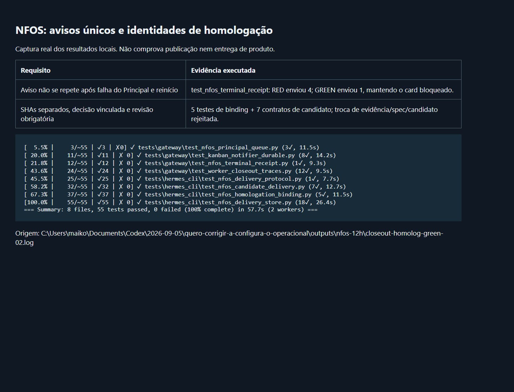

# NFOS: terminal notices and homologation identities

Terminal worker notices could bypass the durable notification receipt and repeat while the Principal wake was retried. Receipt-backed terminal text now has one owner: the existing notifier. It renders the full result/reason and trace link, retains the text ACK across gateway restarts, and retries Principal acceptance independently. The display removes its completed bubble without publishing a second closeout. Other workers and receipt-free display paths retain their existing behavior.

The workflow previously used `homolog_sha` for both the actual tested deployment and the candidate submitted for publication. Distinct identities now require a structured `homologation` question, a confirmed HML deployment, a current spec, exact candidate/tree/baseline identities, covered criteria and readable evidence. The Principal may accept or reject same-tree or limited-delta coverage. Acceptance snapshots the evidence hashes and binds the candidate without overwriting the HML receipt. It does not approve publication. PR identity, a separate delivery review, merge tree, integrated SHA, production readback and the final report remain required. Changed evidence, spec or candidate invalidate acceptance.

The program checks identity, presence and integrity of evidence. The Principal must assess whether the comparison, baseline and actual functional validation justify the stated coverage. A limited delta is never represented as a fully tested candidate tree.

## Validation

| Requirement | Status | Evidence |
|---|---|---|
| One terminal notice despite failed Principal acceptance and gateway restarts | PASS local | `test_nfos_terminal_receipt.py`: initial RED sent 4 messages; GREEN sent 1 with the card still blocked |
| Preserve distinct HML/candidate SHAs and require separate publication approval | PASS local | `test_nfos_homologation_binding.py` and `test_nfos_candidate_delivery.py` |
| Reject stale spec/evidence, worker self-acceptance and changed candidates | PASS local | Five binding regressions, plus seven existing candidate contracts |
| Preserve notifier, closeout and delivery contracts | PASS local | Canonical runner: 55 passed, 0 failed across 8 files; `closeout-homolog-green-02.log` |
| Real screenshot of the executed validation | PASS | `contracts.png`, generated by headless Chromium from the recorded log; `VisibleWindows=0` |
| Same code on isolated Linux executor | RUNNING | Private copy of the prepared PR91 release, three focused suites; no production board used |
| Production activation and autonomous product continuation | NOT_RUN | Must be verified after release activation; no card was manually unblocked or approved |

The initial RED log and the zero-visible-window receipt are included next to this report. Ruff 0.15.10 and `git diff --check` passed. The candidate includes PR91 because it branches from the integrated main; PR91 had not yet been activated in the gateways. Release activation therefore also needs its previously recorded suspension/retained-workspace validation and a fresh backup. No AOF, project configuration, product code, task classification or manual task decision is changed by this patch.
