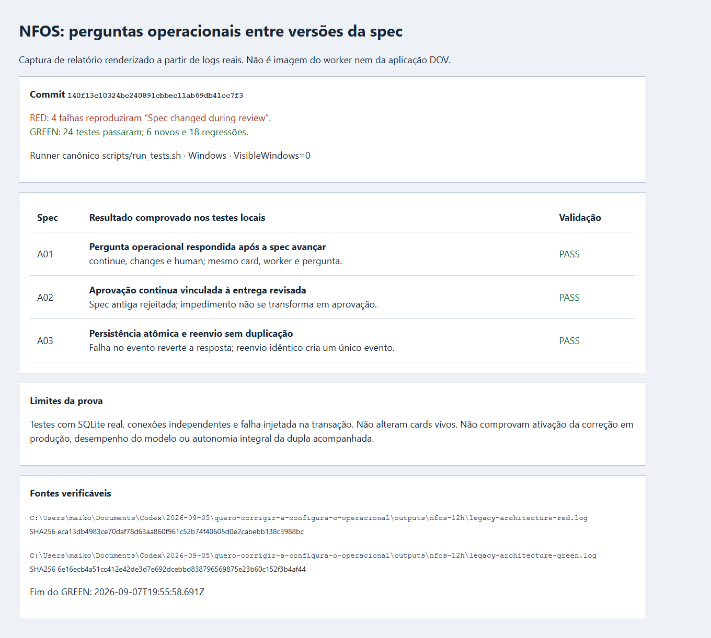

Quando um worker perguntava sobre um impedimento operacional e salvava a spec enquanto o Principal analisava a pergunta, a resposta era rejeitada como uma revisão desatualizada. Isso deixava a pergunta original pendente e induzia novas perguntas ou reconciliação manual.

O NFOS passa a aplicar a identidade da spec às revisões de entrega. Impedimentos aceitam a resposta do Principal após o avanço da spec, preservando a revisão original e registrando ambas as revisões no evento de resolução. A resposta não aprova publicação, não substitui o worker e não altera outros cards. Persistência atômica e reenvio idempotente permanecem no mesmo caminho existente.

Validação realizada com o runner canônico `scripts/run_tests.sh`, em Windows, contra SQLite real:

- RED antes da correção: 4 falhas reproduzindo `Spec changed during review`; 2 controles passaram.
- GREEN: 24 testes passaram, 0 falharam. Arquivos `test_nfos_impediment_revision.py` (6 casos) e `test_nfos_delivery_store.py` (18 regressões).
- Casos: respostas continue/changes/human à pergunta original após reconexão; revisão antiga rejeitada; impedimento não autoriza publicação; resposta/evento atômicos e reenvio sem duplicação.

Linux na VPS `srv1918217`, em cópia isolada da fonte implantada: os seis casos novos também passaram, rc0, encerrados em 07/09/2026 20:10:31 UTC. O transporte expirou oito segundos antes da conclusão; o recibo foi recuperado do destino, sem repetir os testes. Os hashes dos dois arquivos testados correspondem ao commit desta PR.

Nenhum card vivo foi manipulado para obter resultado dos testes. Esta PR não comprova sua ativação em produção nem resolve os timeouts de inicialização dos CLIs de modelos.

Código testado: `140f13c10324bc240891cbbec11ab69db41cc7f3`.

A01: pergunta operacional respondida após avanço da spec. A02: publicação continua vinculada à revisão. A03: resposta/evento atômicos e reenvio idempotente.

Hashes da fonte testada em Linux:

- `hermes_cli/nfos_delivery.py`: `ff8122c0b295cb3217591238ff36db8e80ff92125e97c312c32eb7cbebcbcdaa`
- `tests/hermes_cli/test_nfos_impediment_revision.py`: `5cbbe9dd32e8e07bf44722f67cf51b0a6fa14064a8a6caf5ab03949aa4f0d6ea`

Fonte Linux: `/var/tmp/nfos-12h/legacy-architecture-2fh5idhz/source`, execução 2026-09-07T20:08:11.723166+00:00 a 2026-09-07T20:10:31.324727+00:00.
