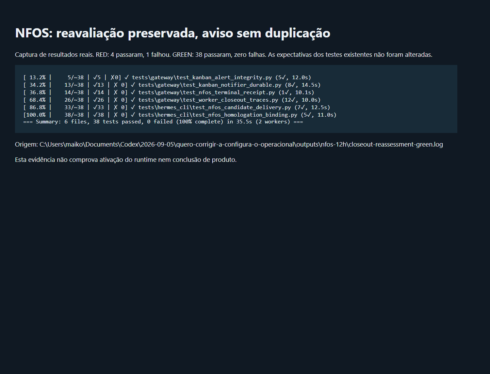

# NFOS: preservar o aviso de reavaliação

**ATIVO EM PRODUÇÃO.** A troca terminou em 08/09/2026 às 04:04:23 UTC. A conferência independente às 04:06:22 UTC confirmou os dois gateways na versão e7a01798709491c71fd01c6a3157777198dac147, configuração preservada e manutenção liberada. O runtime despachou autonomamente os runs Concursa 438 e 439 nessa versão. Isso comprova ativação e retomada do despacho; a conclusão funcional desses novos cards ainda não foi avaliada.

O CI completo do PR92 revelou uma regressão no texto: o renderizador do encerramento sobrescrevia o aviso de reavaliação administrativa, mostrando "Worker bloqueado". A correção mantém o mesmo responsável pelo envio e o mesmo recibo durável, mas aplica o texto de encerramento apenas a eventos de encerramento efetivo. A reavaliação continua breve, sem expor instruções internas.

Não há alteração em decisões do Principal, cards, SHAs, evidências, permissões ou regras de publicação. Este candidato inclui o PR92 e substitui sua ativação pendente.

| Requisito | Resultado | Evidência |
|---|---|---|
| Reproduzir o defeito antes da correção | PASS | Runner canônico, 4 testes passaram e 1 falhou em test_kanban_alert_integrity.py. O aviso dizia Worker bloqueado em vez de em reavaliação. |
| Preservar aviso correto e ocultar texto interno | PASS local | O mesmo teste passou após a mudança; testes e expectativas preservados. |
| Preservar envio único e confirmação independente pelo Principal | PASS local | test_nfos_terminal_receipt e test_kanban_notifier_durable passaram. |
| Preservar mensagens de encerramento e contratos de homologação/candidato | PASS local | 38 testes passaram, zero falhas, em seis arquivos, 35,5 segundos. |
| Lint e diff | PASS | Ruff 0.15.10 e git diff --check. |
| Mesmo código no Linux | PASS | 14 testes passaram, zero falhas, em 245 segundos. Executor /var/tmp/nfos-12h/reassessment-homolog-2lkz3iwq; cinco hashes de origem conferidos. Sem banco ou decisões de produção. |
| Ativação nos gateways | PASS | Conferência independente às 04:06:22 UTC: default PID4006116 e Hermes PF PID4006819, ambos ativos, código na versão e7a0179 e gateway_state com PID correspondente. |
| Preservação e retomada automática | PASS | Configurações idênticas por SHA256, sem arquivos de drain, manutenção liberada. Runs438/439 vivos na nova release. DOVTest permanece sem ready/running. |
| Conclusão E2E dos novos cards de produto | NOT_RUN | A ativação do runtime e o despacho de workers não comprovam a entrega funcional dos cards. Não foram alterados SHAs nem decisões desses cards para facilitar a validação. |
| Evidência visual real | PASS | Captura headless do resultado executado abaixo; os logs originais acompanham o arquivo. Não é comprovação de UI de produto. |

O CI geral do PR92 não passou. O CI do PR91 já registrava as mesmas dez falhas e 26 erros de configuração de perfil em test_kanban_tools.py, além das falhas de áudio citadas anteriormente. A regressão de texto aqui corrigida foi identificada por comparação e reproduzida localmente. Há outras falhas fora dos arquivos alterados e variações de temporização; elas não são apresentadas como resolvidas nem a suíte completa como verde. Fontes locais: outputs/nfos-12h/reassessment-job-101888181535.log e outputs/nfos-12h/closeout-job-101921924412.log.

O orçamento desta retomada foi ampliado explicitamente em cinco pontos percentuais: parada em 15% usado, na mesma janela, preservando a margem até 16%. Sem interferência manual nos cards de produto.

PR93: https://github.com/maikolb/hermes-agent/pull/93. Candidato e7a01798709491c71fd01c6a3157777198dac147; árvore 5204d5973a2df40b6738c161acc6582ee256161e. Release preparada em /usr/local/lib/hermes-agent.release-20260907-e7a01798709491c71fd01c6a3157777198dac147 e backup em /var/backups/hermes/nfos-reassessment-e7a01798709491c71fd01c6a3157777198dac147. Os imports reais kanban/runtime/gateway apontam à nova release. Isso ainda não é ativação dos gateways.

O CI do PR93 passou em Ruff, verificação de Windows, testes Windows, E2E e revisão de dependências. A suíte completa Python ainda está em execução e o teste macOS falhou; não há declaração de CI integralmente verde. Recibo Linux: outputs/nfos-12h/reassessment-status-final.json.

PR93 integrado como face7e0429f1ae907acc4bb05c7bc869091b27ae, com a mesma árvore 5204d5973a2df40b6738c161acc6582ee256161e. O teste macOS que falhou é test_play_audio_file_skips_sounddevice_on_macos, o mesmo dos candidatos anteriores.

A manutenção de publicação suspende novos despachos, mantendo o Principal disponível enquanto os workers e seus filhos encerram. Seu prazo máximo usa o limite existente dos workers nos projetos (7200 segundos), mais 300 segundos para a troca. O limite de execução dos workers não é alterado. A manutenção é liberada ao terminar, falhar ou ser cancelada; não há autorização manual de cards ou publicação de produto. O reconciliador canônico continua funcionando sob os locks durante a espera.

Manutenção iniciada em 08/09/2026 às 03:59:16 UTC, PID 3999838. Às 04:00:25 UTC ainda aguardava t_242329a8 e seus filhos; o worker t_d6a44851 já havia encerrado naturalmente. Ativação ainda não confirmada neste registro. Origem: outputs/nfos-12h/reassessment-activation-observe-01.json.

Acompanhamento automático limitado à conferência dessa publicação e à cota de 15% usado. [Captura real dos recibos Linux e dos gateways](linux.png), com VisibleWindows=0. [Conferência bruta de produção](production-readback.json). Estes recibos substituem o estado de espera descrito no histórico acima.
